<!-- ============================================================
     EASHAN DARSH — GitHub Profile README
     ed6095-web | AI Engineer · Full Stack Developer
     ============================================================ -->

<div align="center">

<!-- ━━━━━━━━━━━━━━━━━━━━━━━━━━━━━━━━━━━━━━━━━━━━━━━━━━━━━━━━━━━━━━━
     §1 · ANIMATED HERO BANNER
━━━━━━━━━━━━━━━━━━━━━━━━━━━━━━━━━━━━━━━━━━━━━━━━━━━━━━━━━━━━━━━ -->



<br/>

<!-- ━━━━━━━━━━━━━━━━━━━━━━━━━━━━━━━━━━━━━━━━━━━━━━━━━━━━━━━━━━━━━━━
     §2 · TYPING ANIMATION
━━━━━━━━━━━━━━━━━━━━━━━━━━━━━━━━━━━━━━━━━━━━━━━━━━━━━━━━━━━━━━━ -->

<a href="https://git.io/typing-svg">
  
</a>

<br/><br/>

<!-- ━━━━━━━━━━━━━━━━━━━━━━━━━━━━━━━━━━━━━━━━━━━━━━━━━━━━━━━━━━━━━━━
     §3 · SOCIAL BUTTONS
━━━━━━━━━━━━━━━━━━━━━━━━━━━━━━━━━━━━━━━━━━━━━━━━━━━━━━━━━━━━━━━ -->

<p>
  <a href="https://github.com/ed6095-web" target="_blank">
    
  </a>
  &nbsp;
  <a href="https://www.linkedin.com/in/eashan-darsh" target="_blank">
    
  </a>
  &nbsp;
  <a href="https://www.instagram.com/eashan.darsh" target="_blank">
    
  </a>
  &nbsp;
  <a href="mailto:eashandarsh@gmail.com">
    
  </a>
</p>

<br/>

</div>

<!-- ━━━━━━━━━━━━━━━━━━━━━━━━━━━━━━━━━━━━━━━━━━━━━━━━━━━━━━━━━━━━━━━
     §4 · ABOUT ME
━━━━━━━━━━━━━━━━━━━━━━━━━━━━━━━━━━━━━━━━━━━━━━━━━━━━━━━━━━━━━━━ -->

<br/>

<table width="100%" border="0" cellspacing="0" cellpadding="0">
<tr>
<td width="55%" valign="top">

### 👋 &nbsp;About Me

I'm **Eashan Darsh**, an AI Engineer and Full Stack Developer from India, currently studying at **SRM Institute of Science and Technology**.

I build **practical AI software** that solves real-world problems — from expense fraud detection to railway safety systems, every project I ship is designed for production.

```yaml
name:       Eashan Darsh
role:       AI Engineer & Full Stack Developer
university: SRM Institute of Science & Technology
location:   India
focus:      Production-grade AI Applications
passion:    Computer Vision · ML · Open Source
status:     Open to Collaborate
```

</td>
<td width="5%"></td>
<td width="40%" valign="top">

### 🎯 &nbsp;Quick Facts

<br/>

🤖 &nbsp;**AI & Machine Learning** enthusiast  
👁️ &nbsp;**Computer Vision** engineer  
🌐 &nbsp;**Full Stack** — React to Flask backends  
🔬 &nbsp;Building **production-grade AI** systems  
📖 &nbsp;Continuous **learner & builder**  
🌱 &nbsp;Love **open source** contributions  
🚀 &nbsp;Turning ideas into **shipped products**  

<br/>

> *"I don't just study AI — I build with it."*

</td>
</tr>
</table>

<br/>

---

<!-- ━━━━━━━━━━━━━━━━━━━━━━━━━━━━━━━━━━━━━━━━━━━━━━━━━━━━━━━━━━━━━━━
     §5 · CURRENT FOCUS
━━━━━━━━━━━━━━━━━━━━━━━━━━━━━━━━━━━━━━━━━━━━━━━━━━━━━━━━━━━━━━━ -->

<br/>

<div align="center">

### 🔭 &nbsp;Currently Building

<br/>

</div>

<table width="100%" border="0">
<tr>
<td width="50%" valign="top">

<div align="center">

**🤖 &nbsp;AI Expense Fraud Detection**


OCR-powered expense verification with AI-driven fraud detection. Processes receipts, validates amounts, and flags anomalies in real-time.

</div>

</td>
<td width="50%" valign="top">

<div align="center">

**🚂 &nbsp;Railway Track Detection**


Real-time railway crack and defect detection using YOLOv8 computer vision for predictive safety maintenance.

</div>

</td>
</tr>
<tr>
<td width="50%" valign="top">

<div align="center">

**👁️ &nbsp;VisionCheck**


Automated vision assessment platform using computer vision — reducing the need for traditional manual testing.

</div>

</td>
<td width="50%" valign="top">

<div align="center">

**🥗 &nbsp;Nutrition Tracker**


AI-powered nutrition analysis platform. Snap a photo, get macros, track your health.

</div>

</td>
</tr>
</table>

<br/>

---

<!-- ━━━━━━━━━━━━━━━━━━━━━━━━━━━━━━━━━━━━━━━━━━━━━━━━━━━━━━━━━━━━━━━
     §6 · TECH STACK
━━━━━━━━━━━━━━━━━━━━━━━━━━━━━━━━━━━━━━━━━━━━━━━━━━━━━━━━━━━━━━━ -->

<br/>

<div align="center">

### 🛠️ &nbsp;Tech Stack

</div>

<br/>

<div align="center">

**Languages**


</div>

<br/>

<div align="center">

**Frontend**


</div>

<br/>

<div align="center">

**Backend & Infrastructure**


</div>

<br/>

<div align="center">

**AI & Machine Learning**


</div>

<br/>

<div align="center">

**Databases & Tools**


</div>

<br/>

---

<!-- ━━━━━━━━━━━━━━━━━━━━━━━━━━━━━━━━━━━━━━━━━━━━━━━━━━━━━━━━━━━━━━━
     §7 · GITHUB ANALYTICS
━━━━━━━━━━━━━━━━━━━━━━━━━━━━━━━━━━━━━━━━━━━━━━━━━━━━━━━━━━━━━━━ -->

<br/>

<div align="center">

### 📊 &nbsp;GitHub Analytics

<br/>

<picture>
  <source
    media="(prefers-color-scheme: dark)"
    srcset="https://github-readme-stats.vercel.app/api?username=ed6095-web&show_icons=true&theme=transparent&hide_border=true&title_color=58A6FF&icon_color=22C55E&text_color=8B949E&bg_color=0D1117&ring_color=58A6FF&include_all_commits=true&count_private=true"
  />
  <source
    media="(prefers-color-scheme: light)"
    srcset="https://github-readme-stats.vercel.app/api?username=ed6095-web&show_icons=true&theme=transparent&hide_border=true&title_color=0969DA&icon_color=1A7F37&text_color=57606A&bg_color=ffffff&include_all_commits=true&count_private=true"
  />
  
</picture>
&nbsp;&nbsp;
<picture>
  <source
    media="(prefers-color-scheme: dark)"
    srcset="https://github-readme-stats.vercel.app/api/top-langs/?username=ed6095-web&layout=compact&theme=transparent&hide_border=true&title_color=58A6FF&text_color=8B949E&bg_color=0D1117&langs_count=8"
  />
  <source
    media="(prefers-color-scheme: light)"
    srcset="https://github-readme-stats.vercel.app/api/top-langs/?username=ed6095-web&layout=compact&theme=transparent&hide_border=true&title_color=0969DA&text_color=57606A&bg_color=ffffff&langs_count=8"
  />
  
</picture>

<br/><br/>

<picture>
  <source
    media="(prefers-color-scheme: dark)"
    srcset="https://streak-stats.demolab.com?user=ed6095-web&theme=transparent&hide_border=true&ring=58A6FF&fire=22C55E&currStreakLabel=58A6FF&sideLabels=8B949E&dates=8B949E&sideNums=F8FAFC&currStreakNum=F8FAFC&background=0D1117"
  />
  <source
    media="(prefers-color-scheme: light)"
    srcset="https://streak-stats.demolab.com?user=ed6095-web&theme=transparent&hide_border=true&ring=0969DA&fire=1A7F37&currStreakLabel=0969DA&sideLabels=57606A&dates=57606A"
  />
  
</picture>

<br/><br/>


</div>

<br/>

---

<!-- ━━━━━━━━━━━━━━━━━━━━━━━━━━━━━━━━━━━━━━━━━━━━━━━━━━━━━━━━━━━━━━━
     §8 · GITHUB TROPHIES
━━━━━━━━━━━━━━━━━━━━━━━━━━━━━━━━━━━━━━━━━━━━━━━━━━━━━━━━━━━━━━━ -->

<br/>

<div align="center">

### 🏆 &nbsp;Trophies

<br/>


</div>

<br/>

---

<!-- ━━━━━━━━━━━━━━━━━━━━━━━━━━━━━━━━━━━━━━━━━━━━━━━━━━━━━━━━━━━━━━━
     §9 · CONTRIBUTION SNAKE
━━━━━━━━━━━━━━━━━━━━━━━━━━━━━━━━━━━━━━━━━━━━━━━━━━━━━━━━━━━━━━━ -->

<br/>

<div align="center">

### 🐍 &nbsp;Contribution Snake

<br/>

<picture>
  <source media="(prefers-color-scheme: dark)" srcset="https://raw.githubusercontent.com/ed6095-web/ed6095-web/output/github-contribution-grid-snake-dark.svg" />
  <source media="(prefers-color-scheme: light)" srcset="https://raw.githubusercontent.com/ed6095-web/ed6095-web/output/github-contribution-grid-snake.svg" />
  
</picture>

</div>

<br/>

---

<!-- ━━━━━━━━━━━━━━━━━━━━━━━━━━━━━━━━━━━━━━━━━━━━━━━━━━━━━━━━━━━━━━━
     §10 · FEATURED PROJECTS
━━━━━━━━━━━━━━━━━━━━━━━━━━━━━━━━━━━━━━━━━━━━━━━━━━━━━━━━━━━━━━━ -->

<br/>

<div align="center">

### 🚀 &nbsp;Featured Projects

<br/>

</div>

<!-- Project 1 -->
<table width="100%" border="0">
<tr>
<td>

<div align="left">

#### 🤖 &nbsp;AI Expense Fraud Detection

> **AI-powered expense verification platform using OCR and intelligent fraud detection.**

Built a production-ready platform that extracts data from receipts using OCR, cross-validates against policies, and flags fraudulent claims using AI anomaly detection. Designed for enterprise finance teams.

<p>
  
  
  
  
  
</p>

<a href="https://github.com/ed6095-web">
  
</a>

</div>

</td>
</tr>
</table>

<br/>

<!-- Project 2 -->
<table width="100%" border="0">
<tr>
<td>

<div align="left">

#### 🚂 &nbsp;Railway Track Detection

> **Computer vision system for real-time railway crack and defect detection using YOLOv8.**

A safety-critical CV system deployed to detect cracks, fractures, and deformations in railway tracks in real-time. Reduces manual inspection overhead and enables predictive maintenance at scale.

<p>
  
  
  
</p>

<a href="https://github.com/ed6095-web">
  
</a>

</div>

</td>
</tr>
</table>

<br/>

<!-- Project 3 -->
<table width="100%" border="0">
<tr>
<td>

<div align="left">

#### 🥗 &nbsp;Nutrition Tracker

> **AI-powered nutrition analysis and meal tracking platform.**

An intelligent platform that lets users log meals, analyze nutritional content via AI, and track daily intake. Features a clean React UI backed by a robust AI analysis API with persistent SQL storage.

<p>
  
  
  
</p>

<a href="https://github.com/ed6095-web">
  
</a>

</div>

</td>
</tr>
</table>

<br/>

<!-- Project 4 -->
<table width="100%" border="0">
<tr>
<td>

<div align="left">

#### 👁️ &nbsp;VisionCheck

> **Automated vision assessment platform using computer vision algorithms.**

Replaces traditional manual vision testing with an intelligent CV pipeline. Uses pupil tracking, response analysis, and pattern recognition to perform screenings — accessible and fast.

<p>
  
  
  
</p>

<a href="https://github.com/ed6095-web">
  
</a>

</div>

</td>
</tr>
</table>

<br/>

---

<!-- ━━━━━━━━━━━━━━━━━━━━━━━━━━━━━━━━━━━━━━━━━━━━━━━━━━━━━━━━━━━━━━━
     §11 · TIMELINE
━━━━━━━━━━━━━━━━━━━━━━━━━━━━━━━━━━━━━━━━━━━━━━━━━━━━━━━━━━━━━━━ -->

<br/>

<div align="center">

### 📅 &nbsp;Journey Timeline

</div>

<br/>

```
2025 ─────────────────────────────────────────────────────────────
  │
  ├── 🚀  Started AI & Machine Learning journey
  │
  ├── 👁️  Built VisionCheck — automated vision assessment system
  │
  └── 🎓  Deepened expertise in Computer Vision & Deep Learning

2026 ─────────────────────────────────────────────────────────────
  │
  ├── 🤖  Shipped AI Expense Fraud Detection (OCR + AI)
  │
  ├── 🚂  Deployed Railway Track Detection (YOLOv8 + OpenCV)
  │
  ├── 🥗  Built Nutrition Tracker (React + AI API)
  │
  └── 🔭  Continuously building · learning · shipping  ──▶ NOW
```

<br/>

---

<!-- ━━━━━━━━━━━━━━━━━━━━━━━━━━━━━━━━━━━━━━━━━━━━━━━━━━━━━━━━━━━━━━━
     §12 · GOALS
━━━━━━━━━━━━━━━━━━━━━━━━━━━━━━━━━━━━━━━━━━━━━━━━━━━━━━━━━━━━━━━ -->

<br/>

<div align="center">

### 🎯 &nbsp;Goals & Roadmap

</div>

<br/>

<table width="100%" border="0">
<tr>
<td width="50%" valign="top">

**🏗️ &nbsp;Technical Goals**

- `[ ]` &nbsp;Ship production AI applications end-to-end
- `[ ]` &nbsp;Containerize all projects with **Docker**
- `[ ]` &nbsp;Deploy scalable infra with **Kubernetes**
- `[ ]` &nbsp;Master **System Design** at scale
- `[ ]` &nbsp;Contribute to major **Open Source** AI libraries
- `[ ]` &nbsp;Build a real-time CV pipeline from scratch

</td>
<td width="50%" valign="top">

**📈 &nbsp;Growth Goals**

- `[ ]` &nbsp;Build a public research-backed AI project
- `[ ]` &nbsp;Write technical blogs on AI & CV
- `[ ]` &nbsp;Mentor other developers in AI/ML
- `[ ]` &nbsp;Publish papers on computer vision applications
- `[ ]` &nbsp;Build a startup-worthy AI product
- `[ ]` &nbsp;Join a world-class AI team

</td>
</tr>
</table>

<br/>

---

<!-- ━━━━━━━━━━━━━━━━━━━━━━━━━━━━━━━━━━━━━━━━━━━━━━━━━━━━━━━━━━━━━━━
     §13 · QUOTE
━━━━━━━━━━━━━━━━━━━━━━━━━━━━━━━━━━━━━━━━━━━━━━━━━━━━━━━━━━━━━━━ -->

<br/>

<div align="center">

<table border="0" width="72%">
<tr>
<td align="center">

<br/>

*"The best way to predict the future is to build it."*

&mdash; Alan Kay

<br/>

</td>
</tr>
</table>

</div>

<br/>

---

<!-- ━━━━━━━━━━━━━━━━━━━━━━━━━━━━━━━━━━━━━━━━━━━━━━━━━━━━━━━━━━━━━━━
     §14 · FOOTER
━━━━━━━━━━━━━━━━━━━━━━━━━━━━━━━━━━━━━━━━━━━━━━━━━━━━━━━━━━━━━━━ -->

<br/>

<div align="center">


<br/><br/>


<br/><br/>

**⭐ Star some repositories if you find them useful!**

<br/>

<sub>
Built with precision by <a href="https://github.com/ed6095-web"><strong>Eashan Darsh</strong></a> · SRM Institute of Science and Technology · India
</sub>

</div>
