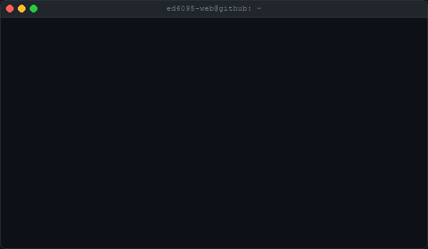

<!--
  ╔══════════════════════════════════════════════════════════╗
  ║   GitHub Profile README — Eashan Darsh (@ed6095-web)    ║
  ║   Style : Linux Terminal × Cyberpunk × GitHub Dark      ║
  ║   Generated with Antigravity                             ║
  ╚══════════════════════════════════════════════════════════╝
-->

<div align="center">

<!-- ████████████████████ HEADER TERMINAL GIF ████████████████████ -->



<br/>
<br/>

<!-- ████████████████████ MATRIX DIVIDER ████████████████████ -->



</div>

<br/>

<!-- ████████████████████ § 1 — WHOAMI ████████████████████ -->

<div align="center">

```
┌──────────────────────────────────────────────────────────────────┐
│  ed6095-web@github:~$  whoami                                    │
└──────────────────────────────────────────────────────────────────┘
```

</div>

```yaml
  Name        :  Eashan Darsh
  Role        :  Engineering Student  ·  Backend Developer
  Education   :  B.Tech Computer Science Engineering  (AI & ML)
  Focus       :  Backend Development  ·  System Design  ·  AI
  OS          :  Windows
  Editor      :  VS Code
  Location    :  Chennai, Tamil Nadu, India
  Arch        :  x86_64
  Languages   :  Python, Java, C, C++, JavaScript
  Status      :  [ Building every day ]
```

<div align="center">

</div>

<br/>

<!-- ████████████████████ § 2 — TECH STACK ████████████████████ -->

<div align="center">

```
┌──────────────────────────────────────────────────────────────────┐
│  ed6095-web@github:~$  cat tech_stack.json                      │
└──────────────────────────────────────────────────────────────────┘
```

**`// LANGUAGES`**

[](https://python.org)
[](https://java.com)
[](#)
[](#)
[](https://javascript.com)

<br/>

**`// FRONTEND`**

[](#)
[](#)
[](https://reactjs.org)

<br/>

**`// BACKEND & INFRA`**

[](https://firebase.google.com)
[](https://nodejs.org)

<br/>

**`// TOOLS & ENVIRONMENT`**

[](https://git-scm.com)
[](https://github.com/ed6095-web)
[](#)
[](#)

</div>

<br/>

<div align="center">

</div>

<br/>

<!-- ████████████████████ § 3 — ROADMAP ████████████████████ -->

<div align="center">

```
┌──────────────────────────────────────────────────────────────────┐
│  ed6095-web@github:~$  cat roadmap.txt                          │
└──────────────────────────────────────────────────────────────────┘
```

</div>

```bash
╔══════════════════════════════════════════════════════════════════╗
║  LEARNING ROADMAP                              [ ed6095-web ]   ║
╠══════════════════════════════════════════════════════════════════╣
║                                                                  ║
║   COMPLETED                                                      ║
║  ─────────────────────────────────────────────────────────────  ║
║  [✓]  Data Structures & Algorithms                               ║
║  [✓]  Object Oriented Programming                                ║
║  [✓]  Backend APIs & REST Architecture                           ║
║  [✓]  System Design  (Fundamentals)                              ║
║  [✓]  Database Design  (SQL / Firebase)                          ║
║                                                                  ║
║   IN PROGRESS                                                    ║
║  ─────────────────────────────────────────────────────────────  ║
║  [→]  Operating Systems  (Internals)                             ║
║  [→]  Computer Networks                                          ║
║  [→]  Advanced System Design                                     ║
║                                                                  ║
║   NEXT                                                           ║
║  ─────────────────────────────────────────────────────────────  ║
║  [ ]  Docker & Container Orchestration                           ║
║  [ ]  Kubernetes                                                 ║
║  [ ]  Distributed Systems                                        ║
║  [ ]  Machine Learning  (Deep Dive)                              ║
║  [ ]  Open Source Contributions                                  ║
║                                                                  ║
╚══════════════════════════════════════════════════════════════════╝
```

<br/>

<div align="center">

</div>

<br/>

<!-- ████████████████████ § 4 — FEATURED PROJECTS ████████████████████ -->

<div align="center">

```
┌──────────────────────────────────────────────────────────────────┐
│  ed6095-web@github:~$  ls -la projects/                         │
└──────────────────────────────────────────────────────────────────┘
```

<br/>

<!-- Project Cards Row 1 -->
<table>
<tr>
<td width="50%" valign="top">

<h3><code>◈</code>&nbsp; Wavvy Blog</h3>

```
Social Media & Blog Platform
```

<p>A full-featured social media and blog platform where users can create posts, follow others, and engage with content. Built with React and Firebase with real-time feed updates.</p>

<p>


</p>

<p>
<a href="https://github.com/ed6095-web/blog">

</a>
</p>

<sub>🟢 Live · Posts · User Discovery · Real-time Feed</sub>

</td>
<td width="50%" valign="top">

<h3><code>◈</code>&nbsp; Library Management System</h3>

```
Full-Stack LMS with JDBC & SQL
```

<p>Java-based Library Management System with SQL backend and JDBC connectivity. Handles book inventory, member management, issue and return tracking with financial reporting.</p>

<p>


</p>

<p>
<a href="https://github.com/ed6095-web/Library-Management-System">

</a>
</p>

<sub>🟢 Complete · Book Browsing · Loan Mgmt · Financial Tracking</sub>

</td>
</tr>
</table>

<!-- Project Card Row 2 -->
<table>
<tr>
<td width="50%" valign="top">

<h3><code>◈</code>&nbsp; Droporia</h3>

```
Advanced Multi-Platform Video Downloader
```

<p>Advanced video downloader supporting YouTube, Instagram, TikTok, and Twitter. Supports MP4 and MP3 output with multiple quality options and download history tracking.</p>

<p>


</p>

<p>
<a href="https://github.com/ed6095-web/DROPORIA">

</a>
</p>

<sub>🟢 4 Platforms · MP4 + MP3 · Quality Options · History Tracking</sub>

</td>
<td width="50%" valign="top">

<h3><code>◈</code>&nbsp; More Coming Soon</h3>

```
Currently in development ...
```

<p>Building new systems focused on backend architecture, distributed design, and open source tooling. Follow along to see what ships next.</p>

<p>

</p>

<p>
<a href="https://github.com/ed6095-web">

</a>
</p>

<sub>⟳ Watch this space</sub>

</td>
</tr>
</table>

</div>

<br/>

<div align="center">

</div>

<br/>

<!-- ████████████████████ § 5 — GITHUB STATS ████████████████████ -->

<div align="center">

```
┌──────────────────────────────────────────────────────────────────┐
│  ed6095-web@github:~$  gh stats --user ed6095-web              │
└──────────────────────────────────────────────────────────────────┘
```

<br/>

<!-- Row 1: Stats + Languages -->

&nbsp;&nbsp;


<br/><br/>

<!-- Row 2: Streak -->


<br/><br/>

<!-- Row 3: Trophies -->


</div>

<br/>

<div align="center">

</div>

<br/>

<!-- ████████████████████ § 6 — ACTIVITY GRAPH ████████████████████ -->

<div align="center">

```
┌──────────────────────────────────────────────────────────────────┐
│  ed6095-web@github:~$  git log --graph --all --oneline          │
└──────────────────────────────────────────────────────────────────┘
```

<br/>


</div>

<br/>

<div align="center">

</div>

<br/>

<!-- ████████████████████ § 7 — DEV QUOTE ████████████████████ -->

<div align="center">

```
┌──────────────────────────────────────────────────────────────────┐
│  ed6095-web@github:~$  cat quote.md                             │
└──────────────────────────────────────────────────────────────────┘
```

<br/>



<br/>
<sub><code>// Quote rotates daily via GitHub Actions</code></sub>

</div>

<br/>

<div align="center">

</div>

<br/>

<!-- ████████████████████ § 8 — CONNECT ████████████████████ -->

<div align="center">

```
┌──────────────────────────────────────────────────────────────────┐
│  ed6095-web@github:~$  open --connect                           │
└──────────────────────────────────────────────────────────────────┘
```

<br/>

<a href="https://github.com/ed6095-web" target="_blank">
  
</a>
&nbsp;
<a href="https://www.linkedin.com/in/eashandarsh/" target="_blank">
  
</a>
&nbsp;
<a href="https://www.instagram.com/eashan_darsh/" target="_blank">
  
</a>
&nbsp;
<a href="mailto:eashandarsh77@gmail.com" target="_blank">
  
</a>

<br/><br/>

```
  ──────────────────────────────────────────────────────
  │  Open to:  Collaborations  ·  Open Source  ·  Work │
  ──────────────────────────────────────────────────────
```

</div>

<br/>

<div align="center">

</div>

<br/>

<!-- ████████████████████ FOOTER ████████████████████ -->

<div align="center">

```
┌──────────────────────────────────────────────────────────────────┐
│                                                                  │
│   $ echo "built with obsession · powered by coffee"             │
│   $ uptime -p && echo "deployed on github"                      │
│                                                                  │
│   © 2024–2025  Eashan Darsh  |  @ed6095-web                    │
│                                                                  │
└──────────────────────────────────────────────────────────────────┘
```

<br/>

<sub>
  <code>// README generated fresh. No templates. No generators. Just craft.</code>
</sub>

<br/><br/>


</div>
